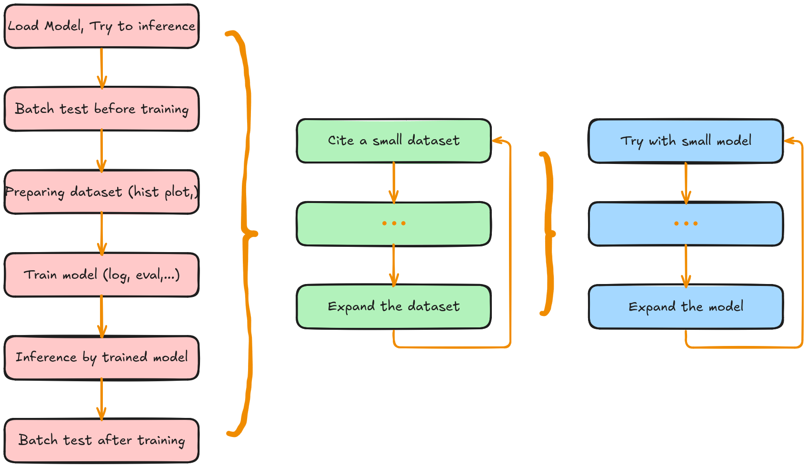

# ft2
fine tune llama 3.2

<div align="center">
  
</div>

- train command: `nohup python train.py --data_file "./data/sarcasm.csv" --output_dir "./fine-tuned-model" > output.log 2>&1 &`

- view log: `tail -f output.log`

- test model: `python test.py --data_file_path ./data/sarcasm.csv --model_id fine-tuned-model --cuda_device 0 --max_length 128`

before finetune

```
{'BERTScore': {'Precision': 0.8277986645698547, 'Recall': 0.8530203700065613, 'F1': 0.8401092886924744}, 'ROUGE-L': {'F1': 0.0794529113715608, 'Precision': 0.057397086892784416, 'Recall': 0.16667777018694505}, 'BLEU-4': 0.0027716679935327476, 'F1-Score': 0.8402202725410461}
```

after finetune

```
{'BERTScore': {'Precision': 0.8509647250175476, 'Recall': 0.876897931098938, 'F1': 0.863616406917572}, 'ROUGE-L': {'F1': 0.1416847936719217, 'Precision': 0.10668925006579812, 'Recall': 0.23828849169350153}, 'BLEU-4': 0.22531999050937368, 'F1-Score': 0.8637367486953735}
```

# references

[llama-fine-tune-guide](https://github.com/AlexandrosChrtn/llama-fine-tune-guide/tree/main)

[prompt-engineering-with-llama-2](https://www.deeplearning.ai/short-courses/prompt-engineering-with-llama-2/)